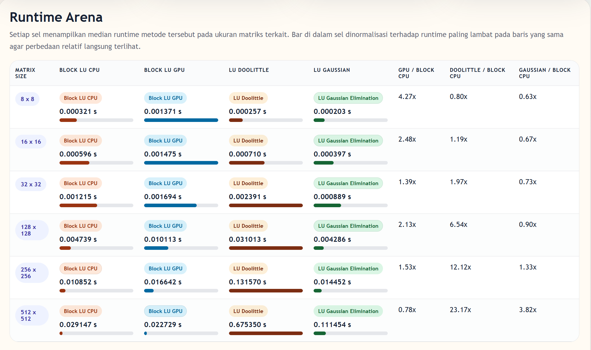
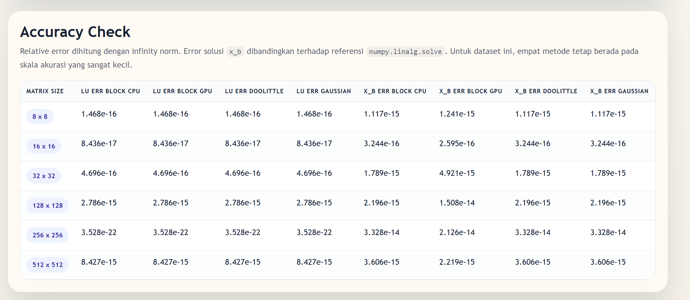
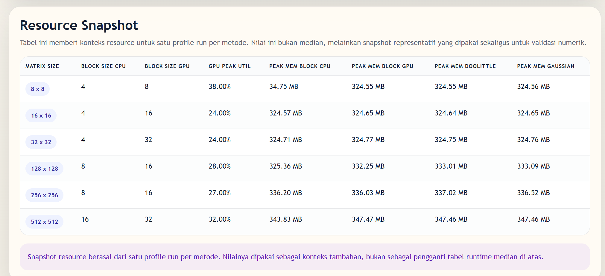

# Banded Linear System Experiments

This repository contains implementations and experiments for solving banded linear systems, with two main viewpoints:

- `Block LU` as a general-purpose method for banded systems that do not have a simple specialized solver.
- `Thomas algorithm` as the specialized solver for tridiagonal systems.

The current codebase includes CPU and GPU variants of Block LU, benchmark scripts, generated tridiagonal datasets, and a report-oriented workflow used to compare numerical accuracy, runtime, and resource usage.

## Main Files

- `block_lu_cpu.py`: Block LU factorization on CPU.
- `block_lu_gpu.py`: Block LU factorization with GPU-assisted solves and Schur complement updates.
- `thomas_algorithm.py`: Thomas algorithm for tridiagonal systems.
- `benchmark_tridiagonal_html.py`: tridiagonal benchmark pipeline and HTML output generation.
- `benchmark_lu_cpu_variants.py`: CPU-side comparison between Block LU, Doolittle, and Gaussian elimination.
- `generate_tridiagonal_datasets.py`: generator for large tridiagonal test matrices.

## Project Direction

The experiments in this repository separate two cases that should not be mixed.

For a general banded system, Block LU is still a reasonable fallback because it does not rely on tridiagonal-specific structure. In this implementation, the blocked organization is used to improve locality and to make the expensive trailing update more efficient than a naive non-blocked LU path.

For a special banded system such as the tridiagonal matrices used in the benchmark, Thomas algorithm is the right tool. It works directly on compact 1D bands, which is why its runtime and memory footprint are much smaller than Block LU on the same structured input.

## Visual Summary

The screenshots below come from the comparison dashboards generated during the benchmark runs.

### Runtime Arena

This view summarizes the median runtime for each method at each matrix size. The relative bars make it easy to see that Block LU CPU is competitive against the classical dense LU variants, while Block LU GPU only starts to become interesting near the larger tested sizes. On the tridiagonal side of the project, the same broader lesson holds: a general solver can still be respectable, but it will usually lose to a solver that fully exploits the matrix structure.

### Accuracy Check

This table verifies that the comparison is not a speed-only story. Across the tested sizes, the LU reconstruction error and the `x_b` solution error remain very small, which shows that the methods are numerically consistent for these datasets. That matters because the performance conclusions would be much weaker if the faster method were achieving its speed by sacrificing accuracy.

### Resource Snapshot

This resource view gives context to the runtime numbers. It highlights the chosen CPU and GPU block sizes, GPU utilization, and peak memory across methods. The pattern is useful when interpreting the GPU path: even when GPU participation is visible, the tested problem sizes may still be too small to amortize device overhead, especially when compared with a highly structure-aware algorithm such as Thomas on tridiagonal systems.

## High-Level Findings

- For tridiagonal systems, Thomas algorithm is the preferred solver because it has `O(n)` time and `O(n)` memory complexity.
- Block LU remains relevant as a more general method for banded systems that cannot be reduced to Thomas or a close variant.
- In the current implementation, Block LU uses CPU only for `n < 512` and switches to CPU + GPU assistance for `n >= 512`.
- The practical performance story is dominated by structure and locality, not just by raw FLOP counts.

## Repository Notes

- The repository contains generated experiment artifacts and report drafts produced during the study.
- The benchmark screenshots in this README are stored in `assets/readme/` so that they render correctly on GitHub.
